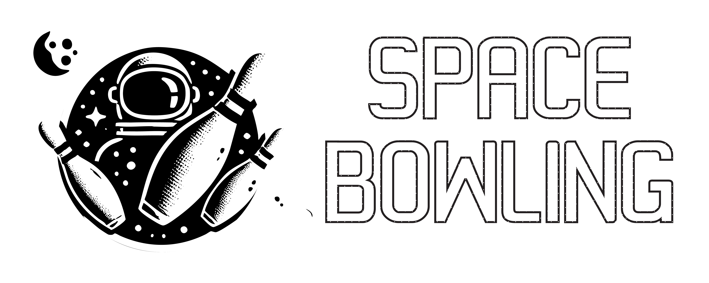

# 🚀 Space Bowling - Cosmic Entertainment Venue

A futuristic space-themed website for Space Bowling entertainment venue featuring online reservations and cutting-edge cosmic UI design.



## 🌌 Features

### 🎳 Entertainment Facilities
- **Quantum Bowling**: 20 state-of-the-art lanes with holographic scoring systems
- **Nebula Billiards**: 12 premium tables with electromagnetic cue technology
- **Galactic Arcade**: 100+ cutting-edge games featuring VR, AR, and classic experiences

### 🛸 Reservation System
- Real-time availability checking
- Interactive booking interface
- Three pricing tiers: Explorer, Commander, and Galactic VIP
- Customer contact management

### 🎨 Cosmic Design
- Futuristic space theme with neon lighting effects
- Custom animations and particle systems
- Holographic card layouts
- Responsive design with mobile-first approach

## 🛠️ Technology Stack

### Frontend
- **React 18** with TypeScript
- **Vite** for development and bundling
- **Tailwind CSS** for styling
- **Radix UI** components with shadcn/ui
- **TanStack Query** for state management
- **React Hook Form** with Zod validation
- **Wouter** for routing

### Backend
- **Express.js** with TypeScript
- **Node.js** runtime
- **In-memory storage** for development
- **Drizzle ORM** for database operations
- **PostgreSQL** integration ready

### Design System
- **Fonts**: Orbitron & Exo 2 for futuristic aesthetic
- **Colors**: Electric cyan, cosmic purple, neon pink
- **Effects**: Neon glows, particle animations, holographic elements

## 🚀 Getting Started

1. **Install dependencies**:
   ```bash
   npm install
   ```

2. **Start the development server**:
   ```bash
   npm run dev
   ```

3. **Open your browser** to see the cosmic experience at:
   ```
   http://localhost:5000
   ```

## 🎯 Color Palette

- **Primary**: `#00D4FF` (Electric Cyan)
- **Secondary**: `#9D4EDD` (Cosmic Purple)  
- **Accent**: `#FF006E` (Neon Pink)
- **Background**: `#0A0A0F` (Deep Space Black)
- **UI Elements**: `#1E1E2E` (Dark Grey)
- **Highlights**: `#00FFA3` (Alien Green)

## 📱 Responsive Design

The website is fully responsive and optimized for:
- Desktop computers
- Tablets
- Mobile devices
- Various screen sizes and orientations

## 🎮 User Experience

### Navigation
- Smooth scrolling navigation
- Mobile-friendly hamburger menu
- Cosmic-themed section transitions

### Reservations
- Interactive facility selection
- Real-time availability display
- Form validation with error handling
- Success notifications

### Visual Effects
- Animated particle background
- Neon glow hover effects
- Floating cosmic elements
- Holographic card designs

## 📄 Project Structure

```
├── client/                 # Frontend React application
│   ├── src/
│   │   ├── components/    # Reusable UI components
│   │   ├── pages/         # Page components
│   │   ├── hooks/         # Custom React hooks
│   │   └── lib/           # Utilities and configurations
├── server/                # Backend Express server
│   ├── index.ts          # Server entry point
│   ├── routes.ts         # API routes
│   └── storage.ts        # Data storage layer
├── shared/                # Shared types and schemas
└── attached_assets/       # Project assets
```

## 🌟 Key Components

- **Hero Section**: Eye-catching landing with cosmic animations
- **Facilities**: Interactive facility showcase with features
- **Reservations**: Complete booking system with validation
- **Pricing**: Tiered pricing display with feature comparisons
- **Contact**: Contact form and venue information

## 🚀 Deployment

This project is configured for easy deployment on Replit and can be deployed with a single click using Replit's deployment system.

## 📞 Contact Information

**Space Station Location**: 1337 Galactic Boulevard, Neo Tokyo, Mars Colony 90210  
**Quantum Communication**: +1 (555) SPACE-88  
**Interstellar Email**: info@spacebowling.galaxy

## 📝 License

This project is licensed under the MIT License - see the [LICENSE](LICENSE) file for details.

---

*Built with cosmic precision and futuristic vision* ⭐️